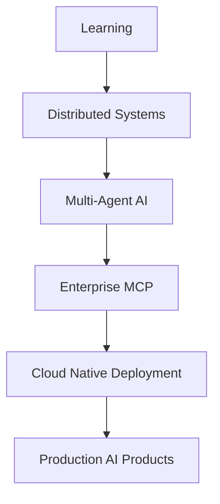

<p align="center">
  
</p>


<h1 align="center">
Hi 👋 I'm Nikhil Kumar Jha
</h1>

<p align="center">

Building Production-Grade AI Systems • Multi-Agent AI • RAG • MCP • Backend Engineering

</p>

<p align="center">

</p>

<p align="center">


</p>

<p align="center">

<a href="https://www.linkedin.com/in/nikhil-kumar-jha-b7650b24b/">

</a>

<a href="mailto:nikhilnkj27@gmail.com">

</a>

<a href="https://github.com/nick2726">

</a>

</p>


# 🚀 Building Production-Grade AI Systems

I'm a final-year Computer Science Engineering student passionate about designing scalable software and enterprise AI systems.

### 🎯 Core Expertise

- 🤖 Multi-Agent AI Systems
- 🧠 Retrieval-Augmented Generation (RAG)
- 🔗 Model Context Protocol (MCP)
- ⚙️ Backend Engineering
- ☁️ Cloud & DevOps
- 🏗️ System Design

---

### 💡 What I Build

Instead of tutorial projects, I build production-ready software featuring:

- Modular Architecture
- REST APIs
- Authentication
- Dockerized Deployment
- Database Design
- AI Agent Orchestration
- Enterprise Folder Structures
- CI/CD Ready Development

---

### 🎯 Career Goal

Software Development Engineer (AI/Backend)

Building intelligent systems that solve real business problems at scale.


# 🛠️ Technology Radar

<table>

<tr>

<td valign="top" width="25%">

### 💻 Languages

- Python
- Java
- C++
- TypeScript
- JavaScript

</td>

<td valign="top" width="25%">

### ⚙️ Backend

- FastAPI
- Django
- Express.js
- Node.js
- REST APIs

</td>

<td valign="top" width="25%">

### 🤖 AI Engineering

- LangChain
- LangGraph
- RAG
- MCP
- OpenAI
- Gemini
- Hugging Face
- PyTorch
- TensorFlow

</td>

<td valign="top" width="25%">

### ☁️ DevOps

- Docker
- Kubernetes
- AWS
- PostgreSQL
- Redis
- GitHub Actions

</td>

</tr>

</table>

# 🏆 Featured Projects

<table>

<tr>

<td width="50%" valign="top">

## 💹 Multi-Agent Financial Research Analyst

> Enterprise-grade AI platform for autonomous financial research using specialized AI agents.

### 🚀 Highlights

- 🤖 Multi-Agent Architecture
- 📈 Financial Analysis
- 📄 SEC Filing Intelligence
- 🧠 Investment Thesis Generation
- 🔍 Peer Comparison
- ⚡ FastAPI Backend
- 🐳 Docker Ready
- 🗄️ PostgreSQL

### Tech Stack

`Python` `FastAPI` `LangGraph`
`Gemini` `Docker`
`PostgreSQL`

<a href="https://github.com/nick2726/multi-agent-financial-research-analyst">

</a>

</td>

<td width="50%" valign="top">

## 🚗 CARVIS AI

> Intelligent in-vehicle AI assistant focused on driver safety and real-time decision support.

### 🚀 Highlights

- 👁 Driver Monitoring
- 😴 Drowsiness Detection
- 😊 Emotion Recognition
- 🎙 Voice Assistant
- 🚘 Computer Vision
- 🤖 AI Decision Engine

### Tech Stack

`Python`
`YOLO`
`OpenCV`
`TensorFlow`

<a href="https://github.com/nick2726/JARVIS-Car-AI">

</a>

</td>

</tr>

<tr>

<td width="50%" valign="top">

## 🛡️ Secure Express API

> Production-ready Express.js security template implementing authentication and API hardening.

### 🚀 Highlights

- 🔐 JWT Authentication
- 👥 Role-Based Access Control
- 🛡 Helmet Security
- 🚦 Rate Limiting
- 🔒 HTTPS Ready
- ⚙️ Production Configuration

### Tech Stack

`Node.js`
`Express`
`JWT`
`Helmet`

<a href="https://github.com/nick2726/secure_express_api">

</a>

</td>

<td width="50%" valign="top">

## 🛒 ShopCart AI

> AI-powered e-commerce platform with intelligent shopping features.

### 🚀 Highlights

- 🛍 Smart Shopping
- 🤖 AI Features
- 📱 Responsive UI
- 🔐 Authentication
- 📦 Product Management

### Tech Stack

`JavaScript`
`React`
`Node.js`

<a href="https://github.com/nick2726/ShopCart--AI-Powered-Smart-ECommerce-Platform">

</a>

</td>

</tr>

</table>


# ⚙️ Production Engineering

<table>

<tr>

<td align="center" width="20%">

### 🏗️ Architecture

Modular Design

Clean Architecture

Scalable Components

</td>

<td align="center" width="20%">

### 🚀 Backend

REST APIs

Authentication

Caching

Async Processing

</td>

<td align="center" width="20%">

### ☁️ DevOps

Docker

AWS

GitHub Actions

Kubernetes

</td>

<td align="center" width="20%">

### 🧠 AI Systems

Multi-Agent AI

RAG

MCP

LLM Integration

</td>

<td align="center" width="20%">

### 📊 Databases

PostgreSQL

Redis

SQLite

Vector Databases

</td>

</tr>

</table>

# 💡 Engineering Philosophy

```text
I don't build projects just to complete tutorials.

I build software that is:

✔ Production Ready

✔ Scalable

✔ Maintainable

✔ Modular

✔ API First

✔ Dockerized

✔ Enterprise Structured

✔ Built for Real Users
```


# 🎯 Currently Building




# 📚 2026 Learning Roadmap

| Quarter | Focus |
|----------|-------|
| ✅ Q1 | Advanced Backend Engineering |
| ✅ Q2 | Multi-Agent AI Systems |
| 🚀 Q3 | Model Context Protocol (MCP) |
| 🚀 Q3 | Kubernetes & Cloud Deployment |
| 🎯 Q4 | Distributed Systems |
| 🎯 Q4 | Production AI Infrastructure |


# 🌍 Open Source Philosophy

I believe great software is built through collaboration.

My repositories are designed with:

- 📖 Clear Documentation
- 🏗️ Clean Project Structure
- 🐳 Docker Support
- 🧪 Testing
- 🔒 Security Best Practices
- 📦 Reusable Components
- 🤝 Community Contributions


### 📊 GitHub Stats:
<br/>
<br/>


### ✍️ Random Dev Quote


<p align="center">

⭐ Thanks for visiting my profile.

If you're interested in AI Systems, Backend Engineering, or Production Software, feel free to connect.

</p>

# 🤝 Let's Connect

<p align="center">

<a href="mailto:nikhilnkj27@gmail.com">

</a>

<a href="https://www.linkedin.com/in/nikhil-kumar-jha-b7650b24b/">

</a>

<a href="https://github.com/nick2726">

</a>

</p>

---


### 🔝 Top Contributed Repo


